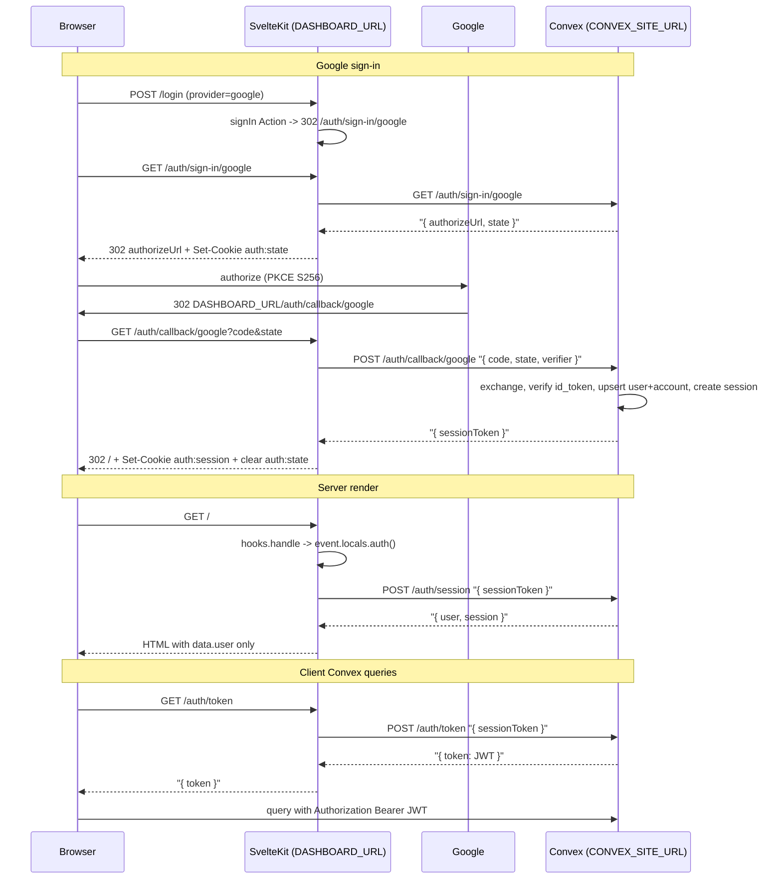

# Finish @repo/auth end-to-end

Convex owns every secret (OAuth client secrets, JWT signing key) and all persistence. SvelteKit is a thin frontend adapter: it owns cookies on `DASHBOARD_URL`, proxies `/auth/*` to Convex, and exposes `event.locals.auth()`.

## Status snapshot (already shipped)

Client-side contract is essentially done. Do NOT redo these:

- [packages/auth/src/sveltekit/types.d.ts](packages/auth/src/sveltekit/types.d.ts) ships `User`, `Session`, `Auth` types and augments `@sveltejs/kit` so `locals.auth()` and `PageData.user` are typed.
- [apps/dashboard/src/app.d.ts](apps/dashboard/src/app.d.ts) is a one-liner `/// <reference types="@repo/auth/sveltekit" />`.
- [apps/dashboard/src/routes/+layout.server.ts](apps/dashboard/src/routes/+layout.server.ts) returns `{ user: auth ? auth.user : null }`.
- [apps/dashboard/src/routes/+layout.svelte](apps/dashboard/src/routes/+layout.svelte) calls `handleAuth({ fetch: async () => !!data.user })`.
- [apps/dashboard/src/routes/(core)/+layout.server.ts](apps/dashboard/src/routes/(core)/+layout.server.ts) guards on `!data.user`.
- [apps/dashboard/src/routes/(core)/+page.svelte](apps/dashboard/src/routes/(core)/+page.svelte) consumes `data.user.email` + `signOut()`.
- [apps/dashboard/src/routes/(auth)/login/+page.svelte](apps/dashboard/src/routes/(auth)/login/+page.svelte) has the hidden `provider=credentials` form.
- [apps/dashboard/src/routes/(auth)/login/+page.server.ts](apps/dashboard/src/routes/(auth)/login/+page.server.ts) re-exports `{ default: signIn }`.
- [apps/dashboard/src/routes/(auth)/+layout.svelte](apps/dashboard/src/routes/(auth)/+layout.svelte) already wires Google/Apple buttons to the client `signIn({ provider })`.
- [apps/dashboard/src/lib/auth.ts](apps/dashboard/src/lib/auth.ts) is the Auth.js-style barrel via `useAuth()`.
- [packages/auth/src/sveltekit/handle-auth.ts](packages/auth/src/sveltekit/handle-auth.ts) fetches `/auth/token` same-origin on the client.
- [packages/auth/src/server/register-routes.ts](packages/auth/src/server/register-routes.ts) already routes `/.well-known/openid-configuration`, `/.well-known/jwks.json`, and has stubs for `/auth/sign-in/:provider` (GET) and `/auth/callback/:provider` (GET+POST).

All remaining work is listed in the todos below.

## Architecture (reference)



## Cookies

- `auth:session` — HttpOnly, Secure, SameSite=Lax, Path=`/`, 30 days. 32-byte base64url opaque refresh token. Server stores `sha256(token + AUTH_SESSION_PEPPER)` in `sessions.refreshTokenHash`.
- `auth:state` — HttpOnly, Secure, SameSite=Lax, Path=`/auth/callback`, 10 min. HMAC-signed JSON `{ nonce, pkceVerifier, provider }`.
- No `auth:token` cookie. JWT is fetched fresh per page by the Convex client.

## Remaining Convex backend work

### 1. Env + auth.config

Update [packages/convex/src/env.ts](packages/convex/src/env.ts) to add:

```ts
CONVEX_SITE_URL: v.string(),
JWKS_PRIVATE_KEY: v.string(),
AUTH_STATE_SECRET: v.string(),
AUTH_SESSION_PEPPER: v.string(),
```

Update [packages/convex/src/auth.config.ts](packages/convex/src/auth.config.ts) from `DASHBOARD_URL` to `CONVEX_SITE_URL`:

```ts
export default {
  providers: [{ domain: getEnv().CONVEX_SITE_URL, applicationID: "convex" }],
} satisfies AuthConfig;
```

### 2. Provider modules

Fill [packages/auth/src/providers/google.ts](packages/auth/src/providers/google.ts) and [packages/auth/src/providers/apple.ts](packages/auth/src/providers/apple.ts). Each exports:

```ts
type Provider = {
  buildAuthorizeUrl(input: { state: string; pkceChallenge: string; redirectUri: string }): string;
  exchangeCode(input: { code: string; pkceVerifier: string; redirectUri: string }):
    Promise<{ idToken: string; accessToken: string }>;
  verifyIdToken(idToken: string):
    Promise<{ subject: string; email: string; emailVerified: boolean; firstName?: string; lastName?: string }>;
};
```

- Google: authorization_endpoint `https://accounts.google.com/o/oauth2/v2/auth`, token endpoint `https://oauth2.googleapis.com/token`, JWKS `https://www.googleapis.com/oauth2/v3/certs`, PKCE S256 required, `scope=openid email profile`.
- Apple: authorization_endpoint `https://appleid.apple.com/auth/authorize`, token endpoint `https://appleid.apple.com/auth/token`, JWKS `https://appleid.apple.com/auth/keys`, `response_mode=form_post`, client secret is a signed JWT built from `APPLE_CLIENT_SECRET` (private key).

### 3. Crypto helpers (Web Crypto only)

Add `packages/auth/src/server/crypto.ts` with:

- `hashPassword(plain)` / `verifyPassword(plain, stored)` using PBKDF2-SHA256, 600k iterations, 16-byte salt, 32-byte derived key. Stored as `${iters}:${base64url(salt)}:${base64url(hash)}`.
- `signJwt(payload)` using RS256 with `JWKS_PRIVATE_KEY` (JWK). Claims `{ iss: CONVEX_SITE_URL, aud: "convex", sub: userId, iat, exp: iat + 60 }`.
- `signState(payload)` / `verifyState(cookie)` using HMAC-SHA256 with `AUTH_STATE_SECRET`.
- `hashRefreshToken(token)` = `sha256(token + AUTH_SESSION_PEPPER)`.
- `randomToken(bytes)` = base64url(`crypto.getRandomValues(...)`).

### 4. Internal Convex functions

Add `packages/convex/src/auth/*.ts` (crpc style from [packages/convex/src/crpc.ts](packages/convex/src/crpc.ts)):

- `users.upsertByEmail(email, firstName, lastName, verified)` -> `Id<"users">`.
- `accounts.getByProviderSubject(provider, subject)`, `accounts.getByEmailCredentials(email)`, `accounts.upsert(userId, provider, subject?, passwordHash?)`.
- `sessions.create(userId, refreshTokenHash, expiresAt)`, `sessions.getByHash(hash)`, `sessions.deleteByHash(hash)`.
- `verifications.create(email, type, tokenHash, expiresAt)`, `verifications.consume(tokenHash)` (for later email verification / password reset).

All invoked from HTTP actions via `ctx.runMutation` / `ctx.runQuery`.

### 5. Convex HTTP actions

Extend [packages/auth/src/server/register-routes.ts](packages/auth/src/server/register-routes.ts). Current stubs for `/auth/sign-in/:provider` and `/auth/callback/:provider` are incomplete (no OAuth call, no state cookie handling). Complete them plus add the missing routes.

Full route inventory after this step:

- `GET /.well-known/openid-configuration` — done.
- `GET /.well-known/jwks.json` — done.
- `GET /auth/sign-in/:provider` — build `authorizeUrl` + signed state, return `{ authorizeUrl, state }` (SvelteKit sets the `auth:state` cookie).
- `GET|POST /auth/callback/:provider` — read `state` + `verifier` from body (forwarded by SvelteKit with cookie contents), verify state HMAC, exchange code, verify id_token, upsert user+account, create session, return `{ sessionToken }`.
- `POST /auth/sign-up` — validate email+password, hash via PBKDF2, upsert user + `accounts(provider=credentials)`, create session, return `{ sessionToken }`.
- `POST /auth/sign-in/credentials` — fetch account by email, verify password, create session, return `{ sessionToken }`.
- `POST /auth/sign-out` — delete session by refresh-token hash.
- `POST /auth/session` — look up session by hash, return `{ user, session } | null`.
- `POST /auth/token` — look up session by hash, sign short-lived JWT (`exp = now + 60s`), return `{ token }`.

## Remaining SvelteKit adapter work

### 6. Rewrite `handle.ts` as proxy + locals injector

Replace [packages/auth/src/sveltekit/handle.ts](packages/auth/src/sveltekit/handle.ts) (currently a stub reading `auth:token`) with:

```ts
export const handle: Handle = async ({ event, resolve }) => {
  const { pathname } = event.url;

  if (pathname.startsWith("/.well-known/")) {
    throw redirect(302, requireEnv("CONVEX_SITE_URL") + pathname);
  }

  if (pathname.startsWith("/auth/")) {
    return proxyAuth(event); // fetch Convex, translate Set-Cookie to dashboard origin
  }

  let cached: Auth | null | undefined;
  event.locals.auth = async () => {
    if (cached !== undefined) return cached;
    const sessionToken = event.cookies.get("auth:session");
    if (!sessionToken) return (cached = null);
    const res = await fetch(requireEnv("CONVEX_SITE_URL") + "/auth/session", {
      method: "POST",
      body: JSON.stringify({ sessionToken }),
      headers: { "content-type": "application/json" },
    });
    cached = res.ok ? ((await res.json()) as Auth) : null;
    return cached;
  };

  return resolve(event);
};
```

`proxyAuth` is a helper that:

- For `GET /auth/sign-in/:provider`: fetches Convex, receives `{ authorizeUrl, state }`, sets signed `auth:state` cookie on dashboard origin, returns `302 authorizeUrl`.
- For `GET|POST /auth/callback/:provider`: reads `auth:state` cookie, POSTs `{ code, state, verifier }` to Convex, receives `{ sessionToken }`, sets `auth:session` cookie, clears `auth:state`, redirects to `/`.
- For `POST /auth/sign-out`: forwards `sessionToken`, clears cookie, redirects to `/login`.
- For `GET /auth/token`: forwards `sessionToken`, returns `{ token }`.

### 7. Implement `signIn` as an Action (`signOut` already done)

Replace the stub in [packages/auth/src/sveltekit/sign-in.ts](packages/auth/src/sveltekit/sign-in.ts). `sign-up` is a separate Action (see section 7b), so `signIn` only handles sign-in flows.

```ts
// sign-in.ts
import { fail, redirect, type RequestEvent } from "@sveltejs/kit";

const signIn = async (event: RequestEvent) => {
  const form = await event.request.formData();
  const provider = String(form.get("provider") ?? "");

  if (provider === "credentials") {
    const email = String(form.get("email") ?? "");
    const password = String(form.get("password") ?? "");
    const res = await event.fetch("/auth/sign-in/credentials", {
      method: "POST",
      headers: { "content-type": "application/json" },
      body: JSON.stringify({ email, password }),
    });
    if (!res.ok) return fail(401, { error: "invalid_credentials", email });
    throw redirect(303, "/");
  }

  if (provider === "google" || provider === "apple") {
    throw redirect(303, `/auth/sign-in/${provider}`);
  }

  return fail(400, { error: "unknown_provider" });
};

export { signIn };
```

[packages/auth/src/sveltekit/sign-out.ts](packages/auth/src/sveltekit/sign-out.ts) is already a working Action:

```1:8:packages/auth/src/sveltekit/sign-out.ts
import { redirect, RequestEvent } from "@sveltejs/kit";

const signOut = async (event: RequestEvent) => {
  await event.fetch("/auth/sign-out", { method: "POST" });
  throw redirect(303, "/login");
};
```

### 7b. Implement `signUp` as a standalone Action

Fill [packages/auth/src/sveltekit/sign-up.ts](packages/auth/src/sveltekit/sign-up.ts) (currently empty). Separate file keeps credentials-register and credentials-login concerns split; no `mode=signup` overload on `signIn`.

Contract with Convex `POST /auth/sign-up`: body `{ email, password, firstName, lastName }` → `200 { sessionToken }` | `409 { error: "email_taken" }` | `400 { error: "weak_password" | "invalid_email" | ... }`. Cookie `auth:session` is set by the proxy in `handle.ts`.

```ts
// sign-up.ts
import { fail, redirect, type RequestEvent } from "@sveltejs/kit";
import * as v from "valibot";

const FormSchema = v.object({
  email: v.pipe(v.string(), v.trim(), v.email()),
  password: v.pipe(v.string(), v.minLength(8)),
  firstName: v.pipe(v.string(), v.trim(), v.minLength(1)),
  lastName: v.pipe(v.string(), v.trim(), v.minLength(1)),
});

type SignUpFailure = {
  error: "invalid_input" | "email_taken" | "weak_password" | "server_error";
  email?: string;
  firstName?: string;
  lastName?: string;
};

const signUp = async (event: RequestEvent) => {
  const raw = Object.fromEntries(await event.request.formData());
  const parsed = v.safeParse(FormSchema, raw);

  const echo = {
    email: String(raw.email ?? ""),
    firstName: String(raw.firstName ?? ""),
    lastName: String(raw.lastName ?? ""),
  };

  if (!parsed.success) {
    return fail(400, { error: "invalid_input", ...echo } satisfies SignUpFailure);
  }

  const res = await event.fetch("/auth/sign-up", {
    method: "POST",
    headers: { "content-type": "application/json" },
    body: JSON.stringify(parsed.output),
  });

  if (res.status === 409) {
    return fail(409, { error: "email_taken", ...echo } satisfies SignUpFailure);
  }

  if (!res.ok) {
    const body = (await res.json().catch(() => ({}))) as { error?: string };
    return fail(res.status, {
      error: body.error === "weak_password" ? "weak_password" : "server_error",
      ...echo,
    } satisfies SignUpFailure);
  }

  throw redirect(303, "/");
};

export { signUp, type SignUpFailure };
```

Add `valibot` (catalog version) to `packages/auth/package.json` dependencies.

Export via the `useAuth()` barrel — update [packages/auth/src/sveltekit/use-auth.ts](packages/auth/src/sveltekit/use-auth.ts):

```ts
import { handle } from "./handle";
import { signIn } from "./sign-in";
import { signUp } from "./sign-up";
import { signOut } from "./sign-out";

function useAuth() {
  return { handle, signIn, signUp, signOut };
}

export { useAuth };
```

Also ship a client helper `signIn({ provider })` at `@repo/auth/sveltekit/client` that calls `location.assign('/auth/sign-in/' + provider)`, since [apps/dashboard/src/routes/(auth)/+layout.svelte](apps/dashboard/src/routes/(auth)/+layout.svelte) already imports it from `$lib/auth`. Two options:

- A. Keep the current Svelte layout using the client helper (requires exporting a JS-callable `signIn` from `@repo/auth/sveltekit` — currently the `useAuth()` barrel re-exports the server `signIn` Action which won't work from the browser). Fix by detecting call site (Action vs. JS) or by splitting imports.
- B. Convert the (auth) layout to per-provider `<form method="POST" action="/login">` with a hidden `provider` field. No JS needed, single code path.

Option B is the simpler default and matches the rest of the app.

### 8. Wire register route

Update [apps/dashboard/src/lib/auth.ts](apps/dashboard/src/lib/auth.ts) to destructure `signUp`:

```ts
import { useAuth } from "@repo/auth/sveltekit";

export const { handle, signIn, signUp, signOut } = useAuth();
```

Add `apps/dashboard/src/routes/(auth)/register/+page.server.ts`:

```ts
import { signUp } from "$lib/auth";
import { redirect, type Actions, type PageServerLoad } from "@sveltejs/kit";

export const load: PageServerLoad = async ({ parent }) => {
  const data = await parent();
  if (data.user) throw redirect(302, "/");
  return {};
};

export const actions = { default: signUp } satisfies Actions;
```

Extend [apps/dashboard/src/routes/(auth)/register/+page.svelte](apps/dashboard/src/routes/(auth)/register/+page.svelte) with first/last name inputs + a typed `form` prop for error surface + value repopulation:

```svelte
<script lang="ts">
  import { resolve } from "$app/paths";
  import type { PageProps } from "./$types";
  let { form }: PageProps = $props();
</script>

<form method="POST">
  <label>First name
    <input name="firstName" value={form?.firstName ?? ""} required />
  </label>
  <label>Last name
    <input name="lastName" value={form?.lastName ?? ""} required />
  </label>
  <label>Email
    <input name="email" type="email" value={form?.email ?? ""} required />
  </label>
  <label>Password
    <input name="password" type="password" minlength="8" required />
  </label>
  <button type="submit">Register</button>

  {#if form?.error}
    <p>
      {#if form.error === "email_taken"}An account with that email already exists.{/if}
      {#if form.error === "invalid_input"}Please check your inputs.{/if}
      {#if form.error === "weak_password"}Password must be at least 8 characters.{/if}
      {#if form.error === "server_error"}Something went wrong. Try again.{/if}
    </p>
  {/if}
</form>

<p>Already have an account? <a href={resolve("/login")}>Log in</a></p>
```

No hidden `provider`/`mode` fields needed — `signUp` is a dedicated Action.

## Types alignment (minor)

The shipped [types.d.ts](packages/auth/src/sveltekit/types.d.ts) uses `verified: boolean` (matches schema). No change needed, but all plan references to `AuthUser.emailVerified` / `avatarUrl` should be read as `verified` / none. When fetching the user in Convex `/auth/session`, return the exact `User` shape:

```ts
{ id, email, firstName, lastName, plan, verified }
```

## Security notes

- `auth:session`: 32-byte random, base64url; SHA-256 + pepper before storing. Rotate on sign-out; optionally rotate on every `/auth/token` call.
- `auth:state`: HMAC-signed JSON, bound to provider to prevent provider mix-up.
- JWT TTL 60s; Convex verifies via its own JWKS (`auth.config.ts` trusts `CONVEX_SITE_URL`).
- PKCE S256 required for Google. Apple uses `response_mode=form_post`.
- Credentials endpoints: add Convex-side rate limiting later (not MVP).

## Out of scope

- Email verification + password reset UI (schema ready, `verifications` table exists).
- Account linking across providers.
- Multi-device session management UI.