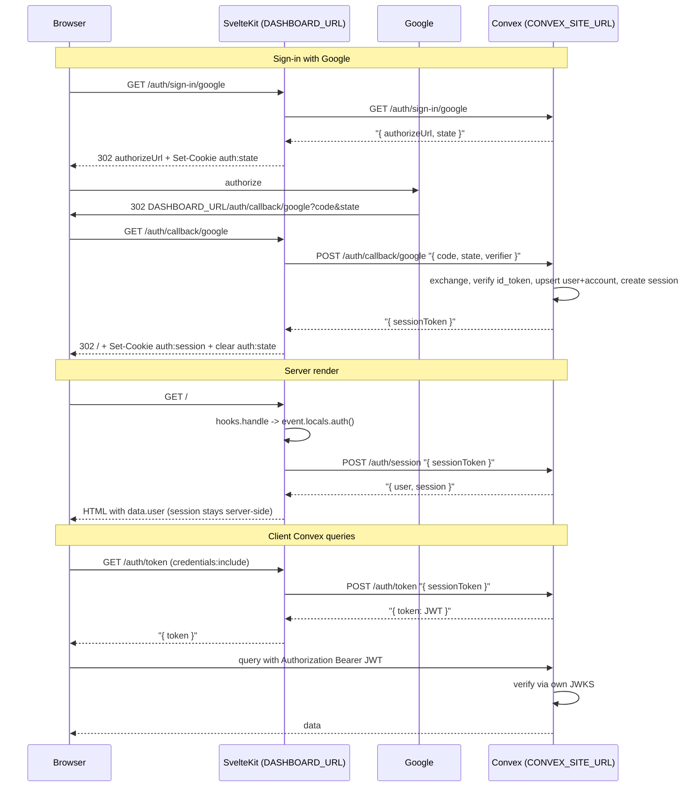

## Architecture

Convex is the backend and owns every secret (OAuth provider secrets, JWT signing key) and all persistence. SvelteKit is a frontend adapter: it owns cookies on `DASHBOARD_URL`, proxies `/auth/*` to Convex, and exposes `event.locals.auth()`.



## Canonical contract

- `AuthUser` mirrors [packages/convex/src/schema.ts](packages/convex/src/schema.ts) users (id, email, firstName, lastName, plan, emailVerified, avatarUrl).
- `AuthSession = { id, userId, expiresAt }` — used server-side only (never shipped to the client).
- `AuthResult = { user: AuthUser; session: AuthSession } | null` — returned from `event.locals.auth()` for server-side consumers (hooks, guards, form actions).
- `event.locals.auth(): Promise<AuthResult>` — memoized per request. Does NOT return the JWT.
- Root `+layout.server.ts` returns `{ user }` only. Session and token never ship in page data.
- Route guards check `data.user` (sufficient for "signed in?"). Server-only logic that needs expiry/rotation reads from `locals.auth()`.
- `@repo/auth/sveltekit` exports `{ handle, signIn, signOut }` mirroring `@auth/sveltekit`. `signIn` and `signOut` are **SvelteKit `Action`s** (shape `(event: RequestEvent) => Promise<...>`), directly usable as form action defaults. Optional client-only `signIn({ provider })` helper available under `@repo/auth/sveltekit/client` for JS navigations.

## Cookies

| Name | Scope | Lifetime | Contents |
| --- | --- | --- | --- |
| `auth:session` | HttpOnly, Secure, SameSite=Lax, Path=`/` | 30 days | Opaque refresh token. Server stores `hash(token)` in `sessions.refreshTokenHash`. |
| `auth:state` | HttpOnly, Secure, SameSite=Lax, Path=`/auth/callback` | 10 min | Signed JSON `{ nonce, pkceVerifier, provider }` used for OAuth CSRF + PKCE. |

No `auth:token` cookie. JWT is fetched fresh per page by the Convex client.

## Convex side (backend)

Implement all auth in Convex HTTP actions under [packages/auth/src/server/register-routes.ts](packages/auth/src/server/register-routes.ts) (already scaffolded) + internal mutations in [packages/convex/src/auth.ts](packages/convex/src/auth.ts).

HTTP actions:

- `GET /.well-known/openid-configuration` — issuer = `CONVEX_SITE_URL`, jwks_uri = `CONVEX_SITE_URL/.well-known/jwks.json`.
- `GET /.well-known/jwks.json` — public JWKS from `JWKS` env.
- `GET /auth/sign-in/:provider` — return `{ authorizeUrl, state }` where state is a signed blob.
- `GET|POST /auth/callback/:provider` — exchange code, verify id_token, upsert user+account, create session, return `{ sessionToken }`.
- `POST /auth/sign-up` — validate email+password, hash (argon2 or bcrypt), upsert user + account(provider=credentials), create session.
- `POST /auth/sign-in/credentials` — verify password, create session.
- `POST /auth/sign-out` — delete session by hash.
- `POST /auth/session` — return `{ user, session }` for a session token (no JWT).
- `POST /auth/token` — rotate and return short-lived JWT (`iss=CONVEX_SITE_URL`, `aud=convex`, `sub=userId`, TTL ~60s).

Internal functions (crpc patterns from [packages/convex/src/crpc.ts](packages/convex/src/crpc.ts)):

- `getUserByEmail`, `getAccountByProviderSubject`, `getAccountByEmailForCredentials`.
- `upsertUserAndAccount`, `createSession`, `getSessionByHash`, `deleteSessionByHash`.
- `createVerification`, `consumeVerification` (for future email verification / password reset).

Update [packages/convex/src/auth.config.ts](packages/convex/src/auth.config.ts):

```ts
export default {
  providers: [
    { domain: getEnv().CONVEX_SITE_URL, applicationID: "convex" },
  ],
} satisfies AuthConfig;
```

Add `CONVEX_SITE_URL` + `JWKS_PRIVATE_KEY` (or reuse `JWKS` if it already includes private) to [packages/convex/src/env.ts](packages/convex/src/env.ts).

## SvelteKit side (frontend adapter)

No provider secrets. No signing keys. Only cookies + proxying.

- [packages/auth/src/sveltekit/handle.ts](packages/auth/src/sveltekit/handle.ts) becomes:
  - Match `/auth/*`: forward request to `CONVEX_SITE_URL + url.pathname` with any existing cookies mapped to body fields (e.g. `auth:session` cookie → `{ sessionToken }` body). Translate Convex responses: if response contains `sessionToken`, set `auth:session` cookie for DASHBOARD_URL.
  - Match `/.well-known/*`: 302 redirect to `CONVEX_SITE_URL + url.pathname` (Convex owns JWKS).
  - Otherwise: inject `event.locals.auth` (memoized), call `CONVEX_SITE_URL/auth/session` with `sessionToken` cookie, return `{ user, session } | null`.
- [packages/auth/src/sveltekit/sign-in.ts](packages/auth/src/sveltekit/sign-in.ts) exports `signIn` as a SvelteKit `Action` (Auth.js pattern). It reads `formData.provider` and, if `credentials`, also `email` and `password`; proxies to the matching Convex endpoint; sets `auth:session` cookie; for social providers it returns a 302 to `/auth/sign-in/:provider` so the browser continues to Convex → Google/Apple. Works without JS.
- [packages/auth/src/sveltekit/sign-out.ts](packages/auth/src/sveltekit/sign-out.ts) exports `signOut` as a SvelteKit `Action`: POST to Convex `/auth/sign-out` with the session cookie, clear `auth:session`, redirect to `/login`.
- [packages/auth/src/sveltekit/handle-auth.ts](packages/auth/src/sveltekit/handle-auth.ts): no change, it already fetches `/auth/token` same-origin.
- Optional client helper (mirrors `@auth/sveltekit/client`): export a tiny `signIn({ provider })` that does `location.assign('/auth/sign-in/' + provider)` for social buttons that prefer JS navigation. Credentials still use the form action.

## Dashboard app before/after

### `apps/dashboard/src/app.d.ts`

Mirror the Auth.js pattern from [source/next-auth/apps/dev/sveltekit/src/app.d.ts](source/next-auth/apps/dev/sveltekit/src/app.d.ts): the app file is a one-liner, and `@repo/auth/sveltekit` ships the `App.Locals` augmentation itself.

Before:

```1:10:apps/dashboard/src/app.d.ts
declare global {
  namespace App {
    interface Locals {
      token: string | undefined;
    }
  }
}

export {};
```

After:

```ts
/// <reference types="@repo/auth/sveltekit" />
```

Inside the package, add `packages/auth/src/sveltekit/types.d.ts` (and reference it from `package.json#types`):

```ts
import type { RequestEvent } from "@sveltejs/kit";

export type AuthUser = {
  id: string;
  email: string;
  firstName: string;
  lastName: string;
  plan: "free" | "pro";
  emailVerified: boolean;
  avatarUrl?: string;
};

export type AuthSession = {
  id: string;
  userId: string;
  expiresAt: number;
};

export type AuthResult = { user: AuthUser; session: AuthSession } | null;

declare module "@sveltejs/kit" {
  interface Locals {
    auth: (event?: RequestEvent) => Promise<AuthResult>;
  }
  interface PageData {
    user: AuthUser | null;
  }
}
```

`PageData.user` is a required `AuthUser | null` (not optional), so every `+layout.server.ts` / `+page.server.ts` must return it explicitly — no `user?.email` access on the client. `AuthSession` is intentionally not included so it cannot be shipped to the browser. Every consuming app gets `locals.auth()` and typed `PageData.user` automatically just by referencing `@repo/auth/sveltekit` in `app.d.ts`.

### `apps/dashboard/src/routes/+layout.server.ts`

Before:

```1:5:apps/dashboard/src/routes/+layout.server.ts
export const load: LayoutServerLoad = async ({ locals }) => {
  return { auth: await locals.auth() };
};
```

After (user only; session and token stay server-side):

```ts
import type { LayoutServerLoad } from "./$types";

export const load: LayoutServerLoad = async ({ locals }) => {
  const auth = await locals.auth();
  return { user: auth ? auth.user : null };
};
```

### `apps/dashboard/src/routes/+layout.svelte`

Before:

```10:14:apps/dashboard/src/routes/+layout.svelte
let { children, data }: LayoutProps = $props();

handleAuth({
  fetch: async () => !!data.token,
});
```

After (decides based on server-resolved user; JWT still fetched inside handleAuth):

```svelte
let { children, data }: LayoutProps = $props();

handleAuth({
  fetch: async () => !!data.user,
});
```

### `apps/dashboard/src/routes/(core)/+layout.server.ts`

Before:

```1:9:apps/dashboard/src/routes/(core)/+layout.server.ts
import { redirect } from "@sveltejs/kit";
import type { LayoutServerLoad } from "./$types";

export const load: LayoutServerLoad = async ({ locals, parent }) => {
  if (!locals.token) throw redirect(302, "/login");
  const data = await parent();
  return { user: data.user! };
};
```

After (guard on user, rely on parent):

```ts
import { redirect } from "@sveltejs/kit";
import type { LayoutServerLoad } from "./$types";

export const load: LayoutServerLoad = async ({ parent }) => {
  const data = await parent();
  if (!data.user) throw redirect(302, "/login");
  return { user: data.user };
};
```

### `apps/dashboard/src/routes/(core)/+page.svelte`

Before:

```1:17:apps/dashboard/src/routes/(core)/+page.svelte
<script lang="ts">
  import { signOut } from "$lib/auth";
  import { db } from "$lib/db";
  import { liveQuery } from "dexie";

  let { data } = $props();

  let projects = $derived(liveQuery(() => db.projects.toArray()));
</script>

<div>
  you're logged in as {data.user.email} and you have {projects.subscribe(
    (p) => p.length,
  )} projects
</div>

<button onclick={() => signOut()}>Sign out</button>
```

After (access `user` only; session stays server-side, typed via `AuthResult`):

```svelte
<script lang="ts">
  import { signOut } from "$lib/auth";
  import { db } from "$lib/db";
  import { liveQuery } from "dexie";

  let { data } = $props();
  let projects = $derived(liveQuery(() => db.projects.toArray()));
</script>

<div>
  Logged in as {data.user.email}.
  You have {projects.subscribe((p) => p.length)} projects.
</div>

<button onclick={() => signOut()}>Sign out</button>
```

### `apps/dashboard/src/lib/auth.ts`

No change — already the Auth.js-style barrel:

```1:4:apps/dashboard/src/lib/auth.ts
import { useAuth } from "@repo/auth/sveltekit";

export const { handle, signIn, signOut } = useAuth();
```

`signIn` and `signOut` are now `Action`s (see package section), so they plug directly into form actions.

### `apps/dashboard/src/routes/(auth)/login/+page.server.ts`

Before:

```1:8:apps/dashboard/src/routes/(auth)/login/+page.server.ts
import { redirect } from "@sveltejs/kit";
import type { PageServerLoad } from "./$types";

export const load: PageServerLoad = async ({ locals }) => {
  if (locals.token) throw redirect(302, "/");
  return {};
};
```

After (guard + import signIn Action from `$lib/auth`, mirrors [source/next-auth/apps/dev/sveltekit/src/routes/signin/+page.server.ts](source/next-auth/apps/dev/sveltekit/src/routes/signin/+page.server.ts)):

```ts
import { redirect } from "@sveltejs/kit";
import { signIn } from "$lib/auth";
import type { Actions, PageServerLoad } from "./$types";

export const load: PageServerLoad = async ({ parent }) => {
  const data = await parent();
  if (data.user) throw redirect(302, "/");
  return {};
};

export const actions = { default: signIn } satisfies Actions;
```

### `apps/dashboard/src/routes/(auth)/login/+page.svelte`

Add a hidden `provider=credentials` field so the shared `signIn` Action dispatches on provider:

```svelte
<form method="POST">
  <input type="hidden" name="provider" value="credentials" />
  <label>Email <input name="email" type="email" /></label>
  <label>Password <input name="password" type="password" /></label>
  <button type="submit">Log in</button>
</form>
```

Same pattern for register: `<input type="hidden" name="provider" value="credentials" />` plus `<input type="hidden" name="mode" value="signup" />`, or point it to a `/register` route with its own `+page.server.ts` that re-exports `signIn` (or a dedicated `signUp` Action).

### `apps/dashboard/src/routes/(auth)/+layout.svelte`

Two options — pick one per the Auth.js reference, either works with the same server Action:

Option A (no-JS friendly, recommended): submit a form per provider.

```svelte
{#each providers as provider}
  <form method="POST" action="/login">
    <input type="hidden" name="provider" value={provider} />
    <button type="submit">Continue with {capitalize(provider)}</button>
  </form>
{/each}
```

Option B (JS client helper): keep the current buttons, use the optional client `signIn`.

```svelte
<script>
  import { signIn } from "@repo/auth/sveltekit/client";
</script>
{#each providers as provider}
  <button onclick={() => signIn({ provider })}>Continue with {capitalize(provider)}</button>
{/each}
```

Either way, the server `signIn` Action on `/login` receives `provider=google|apple`, and responds with a 302 to `/auth/sign-in/<provider>` — which the handle proxies to Convex → Google/Apple. On successful callback, Convex issues a session token, SvelteKit sets `auth:session`, and redirects to `/`.

## Environment variables (final)

Convex (backend):

- existing: `GOOGLE_CLIENT_ID`, `GOOGLE_CLIENT_SECRET`, `APPLE_CLIENT_ID`, `APPLE_CLIENT_SECRET`, `JWKS` (public JWK set), `DASHBOARD_URL`.
- new: `CONVEX_SITE_URL` (issuer), `JWKS_PRIVATE_KEY` (private JWK for signing, RS256), `AUTH_STATE_SECRET` (HMAC key for `auth:state`), `AUTH_SESSION_PEPPER` (extra pepper for `refreshTokenHash`).

SvelteKit:

- `CONVEX_SITE_URL` (public, for proxying).
- No secrets.

## Crypto primitives (Web Crypto only, no deps)

Convex's default runtime exposes `crypto`, `CryptoKey`, `SubtleCrypto`. All crypto in this plan uses Web Crypto:

- **Password hashing**: `crypto.subtle.deriveBits` with PBKDF2-SHA256, 600k iterations, 16-byte random salt per user, 32-byte derived key. Stored as `${iters}:${base64url(salt)}:${base64url(hash)}` in `accounts.passwordHash`.
- **JWT signing (RS256)**: `crypto.subtle.importKey(jwk)` + `crypto.subtle.sign("RSASSA-PKCS1-v1_5", ...)`. Private JWK in `JWKS_PRIVATE_KEY` env, public JWK in `JWKS` env (already present).
- **`auth:state` HMAC**: `crypto.subtle.sign("HMAC", ...)` with SHA-256 key from `AUTH_STATE_SECRET`.
- **Refresh token hashing**: `crypto.subtle.digest("SHA-256", token + pepper)` — pepper from `AUTH_SESSION_PEPPER`.
- **Randomness**: `crypto.getRandomValues(new Uint8Array(32))` for refresh tokens, nonces, PKCE verifier; `crypto.randomUUID()` for ids when needed.

## Security notes

- `auth:session`: 32-byte random, base64url; SHA-256 + pepper before storing in `sessions.refreshTokenHash`. Rotate on sign-out; optionally rotate on every `/auth/token` call.
- `auth:state`: HMAC-signed JSON, bound to provider to prevent provider mix-up.
- JWT TTL ~60s; Convex verifies via its own JWKS (`auth.config.ts` trusts `CONVEX_SITE_URL`).
- PKCE (S256) required for Google. Apple response_mode=form_post uses POST callback.
- Credentials endpoints rate-limited at Convex layer (noted, MVP may ship without).

## Out of scope

- Email verification + password reset UI (schema ready).
- Account linking across providers (schema ready).
- Multi-device session management.
