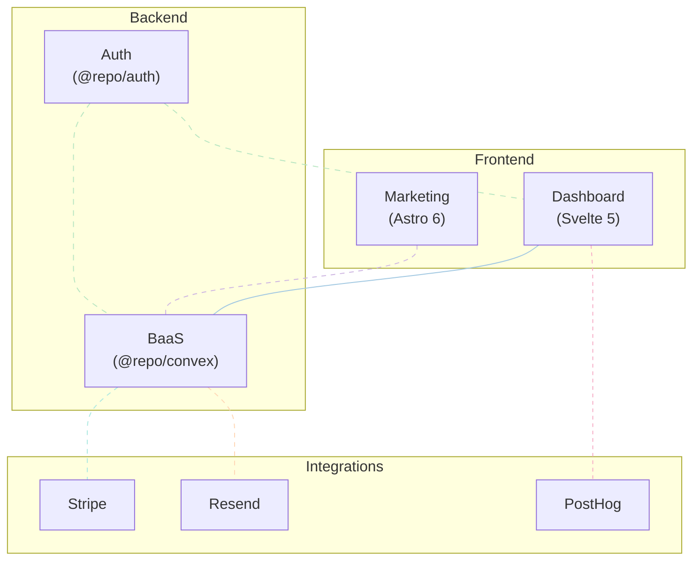

<a href="https://rosace.app">
  <picture>
    <source media="(prefers-color-scheme: dark)" srcset="./.github/dark.png">
    
  </picture>
</a>

<p align="center">
  <a href="https://rosace.app">Marketing</a>
  ·
  <a href="https://app.rosace.app">Dashboard</a>
</p>

> [!NOTE]
> Rosace runs entirely in the browser, thanks to amazing open-source libraries like [GSAP](https://gsap.com/) and [Three.js](https://threejs.org/).

## About

[Rosace](https://rosace.app) is a fast and simple animation tool on the web.

## Usage

You can [login](https://app.rosace.app/login) or [register](https://app.rosace.app/register) to get started.

## Contributing

### Local development

To get up and running:

### 1) Install dependencies

```bash
vp i
```

### 2) Configure root environment files

Create and populate:

- `.env.development`
- `.env.production`

Start from `.env.template` and fill required values.

### 3) Generate app env files

```bash
vp run env
```

This command reads root env files and writes:

- `apps/dashboard/.env.development`
- `apps/dashboard/.env.production`
- `apps/marketing/.env.development`
- `apps/marketing/.env.production`

### 4) Run apps locally

```bash
vp run dev
```

## Architecture

### Diagram



### How it works

This repo has two main apps:

- `apps/marketing`: The public marketing site and changelog.
- `apps/dashboard`: The secure user dashboard (login required).

Supporting packages:

- `packages/convex`: All business logic, including queries, mutations, and actions.
- `packages/auth`: Shared authentication primitives used by both the dashboard and the backend.

## References

- `AGENTS.md`: Repository tooling rules and review checklist.
- `packages/auth/README.md`: In-depth explanation of how authentication works.
- `packages/convex/README.md`: Our custom conventions and patterns for writing code.
