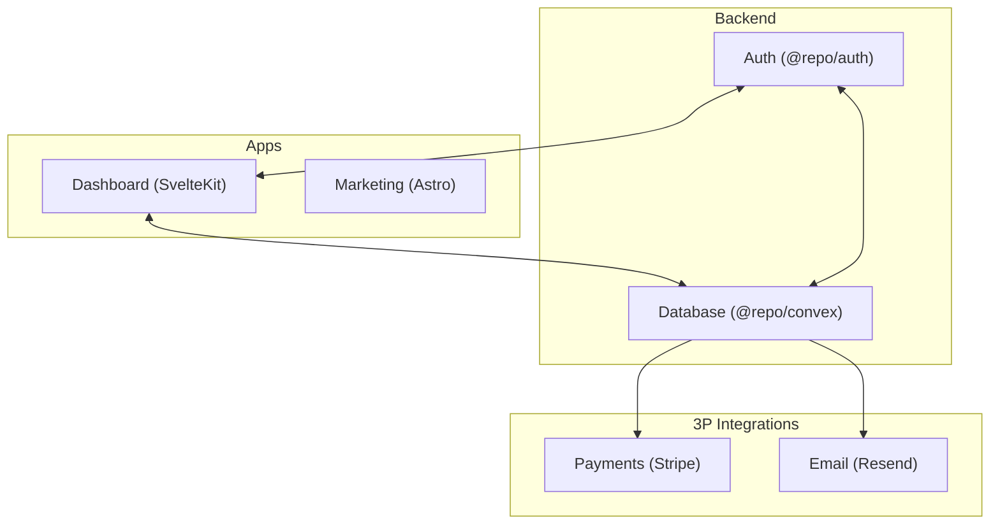

# Rosace

Internal monorepo for the Rosace product stack.

This repository contains:

- `apps/dashboard` - SvelteKit dashboard app deployed on Cloudflare.
- `apps/marketing` - Astro marketing site deployed on Cloudflare.
- `packages/convex` - Convex backend, schema, auth routes, and integrations.
- `packages/auth` - shared auth layer used by dashboard and backend.
- `packages/helpers` - shared utilities used across packages.

> [!IMPORTANT]
> Use `vp` for all project workflows. Do not use `npm`, `pnpm`, `yarn`, or `bun` directly in this repository.

## Start Here

### 1) Install dependencies

```bash
vp install
```

### 2) Configure root environment files

Create and populate:

- `.env.development`
- `.env.production`

Start from `.env.template` and fill required values.

### 3) Generate app env files

```bash
vp run prepare
```

This command reads root env files and writes:

- `apps/dashboard/.env.development`
- `apps/dashboard/.env.production`
- `apps/marketing/.env.development`
- `apps/marketing/.env.production`

### 4) Run apps locally

```bash
vp run dashboard#dev
vp run marketing#dev
```

Defaults:

- Dashboard: `http://localhost:5173`
- Marketing: `http://localhost:4321`

## Daily Developer Tasks

### Run backend workflow (Convex)

```bash
vp exec convex dev
```

### Run project checks

```bash
vp check
vp test
```

Run both commands before opening or updating a PR.

### Build apps

```bash
vp run dashboard#build
vp run marketing#build
```

### Deploy apps

```bash
vp run dashboard#deploy
vp run marketing#deploy
```

## Tooling Rules

- Use `vp` as the single command surface for install, dev, checks, tests, and builds.
- Use `vp run <workspace>#<script>` for workspace scripts.
- Use `vp exec <binary>` for local package binaries (for example Convex CLI).
- Do not call package managers directly in this monorepo.

## Environment Notes

Root keys defined in `.env.template` include:

- `CONVEX_SITE_URL`
- `CONVEX_URL`
- `DASHBOARD_URL`
- `MARKETING_URL`

Some package-level services need additional secrets (auth provider, JWT, Stripe, email, and more). See:

- `packages/convex/README.md`
- `packages/auth/README.md`

## Runtime Architecture

The monorepo has two public web surfaces with different responsibilities:

- `apps/marketing` is the acquisition layer (content, landing pages, SEO).
- `apps/dashboard` is the authenticated product UI.
- `packages/convex` is the source of truth for app data, domain logic, and realtime updates.
- `packages/auth` provides shared auth primitives consumed by dashboard and backend flows.

### Request and data flow



### How to reason about changes

- UI-only changes in `apps/marketing` should not affect dashboard or backend behavior.
- Product behavior changes usually start in `apps/dashboard` and land in `packages/convex`.
- Authentication changes often touch both `packages/auth` and auth usage in `apps/dashboard` or `packages/convex`.
- Integration changes (billing/email) are backend-first and should be implemented in `packages/convex`, then surfaced in UI.

## Command Reference

| Command                   | Purpose                                    |
| ------------------------- | ------------------------------------------ |
| `vp install`              | Install workspace dependencies             |
| `vp run prepare`          | Generate app env files from root env files |
| `vp run dashboard#dev`    | Start dashboard dev server                 |
| `vp run marketing#dev`    | Start marketing dev server                 |
| `vp exec convex dev`      | Run Convex development workflow            |
| `vp check`                | Run format, lint, and type checks          |
| `vp test`                 | Run tests                                  |
| `vp run dashboard#build`  | Build dashboard                            |
| `vp run marketing#build`  | Build marketing                            |
| `vp run dashboard#deploy` | Deploy dashboard to Cloudflare             |
| `vp run marketing#deploy` | Deploy marketing to Cloudflare             |

## Troubleshooting

- `vp run prepare` fails: make sure `.env.development` and `.env.production` exist at repo root.
- App env values look stale: rerun `vp run prepare` after any root env change.
- Auth or backend issues in local dev: verify keys from `packages/auth/README.md` and `packages/convex/README.md`.
- Command behaves unexpectedly: confirm you are using `vp` and not direct package manager commands.

## Additional References

- `AGENTS.md` - repository tooling rules and review checklist.
- `packages/convex/README.md` - backend conventions and Convex usage.
- `packages/auth/README.md` - auth flow and required auth configuration.
